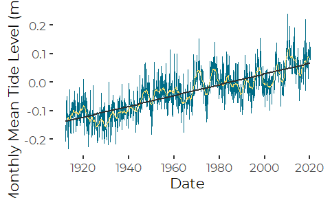
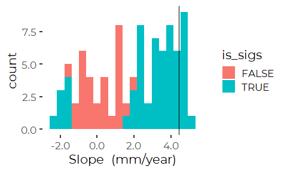
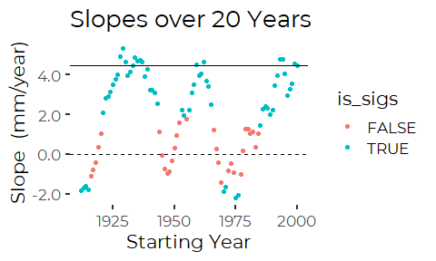
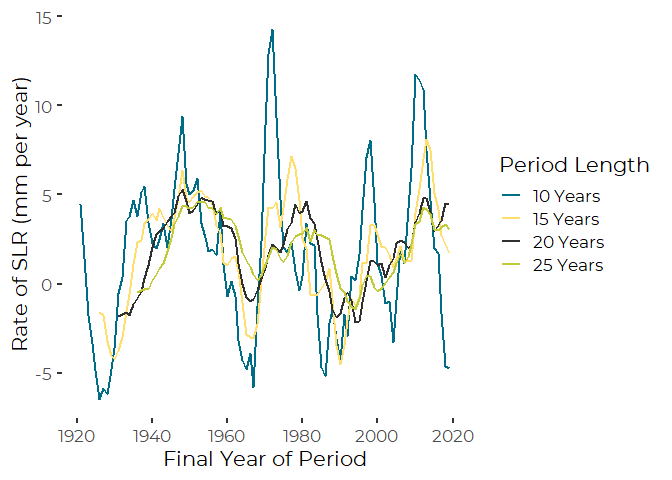
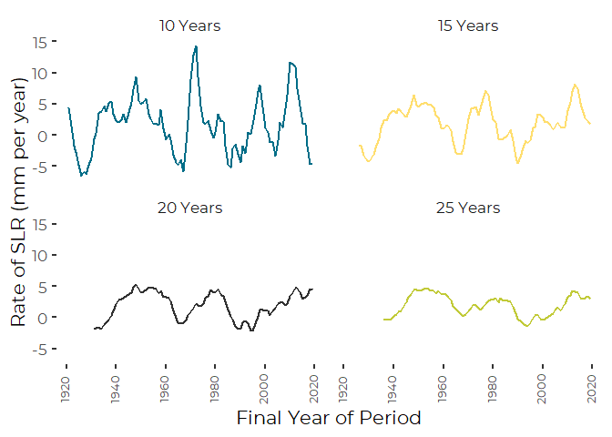
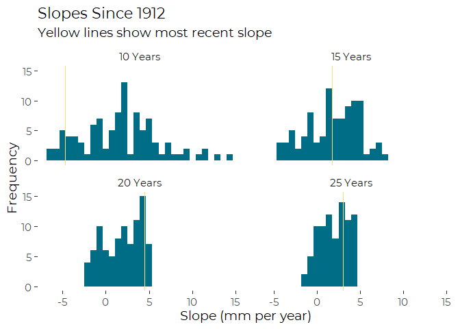

Analysis of Recent Sea Level Rise Trends at Portland, Maine
================
Curtis C. Bohlen

  - [Introduction](#introduction)
  - [Import Libraries](#import-libraries)
  - [Import Data](#import-data)
  - [Estimating the Linear Trend](#estimating-the-linear-trend)
  - [Mimic the NOAA Graphic](#mimic-the-noaa-graphic)
      - [In Meters](#in-meters)
  - [Reanalysis](#reanalysis)
      - [Generate Cutpoints](#generate-cutpoints)
      - [ANCOVA Model](#ancova-model)
      - [Piecewise Linear Regression](#piecewise-linear-regression)
      - [Visualizing the Models](#visualizing-the-models)
      - [Cleanup](#cleanup)
  - [All Periods of A Given Span](#all-periods-of-a-given-span)
      - [Cleanup](#cleanup-1)
  - [Multiple Periods for Arbitrary
    Span](#multiple-periods-for-arbitrary-span)
  - [Single Slope Function](#single-slope-function)
      - [Test by Year](#test-by-year)
      - [Test by Date](#test-by-date)
  - [Multiple Slopes Function](#multiple-slopes-function)
      - [Test Case](#test-case)
      - [Many Slopes and Spans](#many-slopes-and-spans)
  - [Graphic Summaries](#graphic-summaries)


# Introduction

Several reviewers wanted us to highlight that recent SLR rates in our
region are higher than they used to be and so SLR rates are
“accelerating”.

Here we determine whether the data from the Portland Tide Gage supports
that idea.

# Import Libraries

``` r
library(tidyverse)
#> -- Attaching packages --------------------------------------- tidyverse 1.3.0 --
#> v ggplot2 3.3.2     v purrr   0.3.4
#> v tibble  3.0.4     v dplyr   1.0.2
#> v tidyr   1.1.2     v stringr 1.4.0
#> v readr   1.4.0     v forcats 0.5.0
#> -- Conflicts ------------------------------------------ tidyverse_conflicts() --
#> x dplyr::filter() masks stats::filter()
#> x dplyr::lag()    masks stats::lag()
library(readr)

library(zoo)     # for the rollmean function
#> 
#> Attaching package: 'zoo'
#> The following objects are masked from 'package:base':
#> 
#>     as.Date, as.Date.numeric

library(nlme)    # for gls
#> 
#> Attaching package: 'nlme'
#> The following object is masked from 'package:dplyr':
#> 
#>     collapse

library(CBEPgraphics)
load_cbep_fonts()
theme_set(theme_cbep())
```

# Import Data

Our primary source data is based on NOAA’s analysis of sea level trends.
The description on the source web site
(<https://tidesandcurrents.noaa.gov/sltrends/sltrends_station.shtml?id=8418150>)
says the following, so this is apparently NOT raw data.

> “The plot shows the monthly mean sea level without the regular
> seasonal fluctuations due to coastal ocean temperatures, salinities,
> winds, atmospheric pressures, and ocean currents. … The plotted values
> are relative to the most recent Mean Sea Level datum established by
> CO-OPS.”

The following generates many warnings about parsing errors, but all data
appears to be correctly imported.

``` r
sibfldnm <- 'Original Data'
parent <- dirname(getwd())
sibling <- file.path(parent,sibfldnm)
fn <- '8418150_meantrend.csv'
fpath <- file.path(sibling, fn)

slr_data  <- read_csv(fpath, 
                      col_types = cols(Year = col_integer(), 
                                       Month = col_integer(),
                                       Unverified = col_skip(), 
                                       Linear_Trend = col_skip(),
                                       High_Conf. = col_skip(), 
                                       Low_Conf. = col_skip())) %>%

  rename(MSL = Monthly_MSL) %>%
  mutate(theDate = as.Date(paste0(Year,'/', Month,'/',15))) %>%
  mutate(MSL_ft = MSL * 3.28084)
#> Warning: 1299 parsing failures.
#> row col  expected    actual                                                                                                                              file
#>   1  -- 7 columns 8 columns 'C:/Users/curtis.bohlen/Documents/State of the Bay 2020/Data/A6. Climate Change/Portland-SLR/Original Data/8418150_meantrend.csv'
#>   2  -- 7 columns 8 columns 'C:/Users/curtis.bohlen/Documents/State of the Bay 2020/Data/A6. Climate Change/Portland-SLR/Original Data/8418150_meantrend.csv'
#>   3  -- 7 columns 8 columns 'C:/Users/curtis.bohlen/Documents/State of the Bay 2020/Data/A6. Climate Change/Portland-SLR/Original Data/8418150_meantrend.csv'
#>   4  -- 7 columns 8 columns 'C:/Users/curtis.bohlen/Documents/State of the Bay 2020/Data/A6. Climate Change/Portland-SLR/Original Data/8418150_meantrend.csv'
#>   5  -- 7 columns 8 columns 'C:/Users/curtis.bohlen/Documents/State of the Bay 2020/Data/A6. Climate Change/Portland-SLR/Original Data/8418150_meantrend.csv'
#> ... ... ......... ......... .................................................................................................................................
#> See problems(...) for more details.
```

# Estimating the Linear Trend

We use a linear model analysis to compare results to the linear trend
reported by NOAA on the source web page. NOAA reports the rate of sea
level rise in millimeters as \(1.9 \pm 0.14 mm /yr\).

The NOAA data are reported monthly, but to take advantage of the Date
class in R, we expressed monthly data as relating to the fifteenth of
each month.

As a result, our model coefficients are expressed in units per DAY. To
find the relevant annual rate of sea level rise, we would need to
multiply both estimate (slope) and its standard error by 365.25
(approximate length of a year in days) and then multiply again by 1000
to convert from meters to millimeters.

We don’t bother to do that here. Results match the NOAA reported SLR
rate, if you appropriately convert units.

The estimate, even from a simple linear model matches NOAA’s reported
estimate, but the standard error and derived 95% confidence interval are
considerably narrower. NOAA appropriately treated this as an
auto-correlated time series, instead of simply fitting a least squares
linear model. We do the same, specifying and autoregressive error
function of order 1.

``` r
the_gls <- gls(MSL~theDate, data=slr_data,
               correlation = corAR1(), method = 'ML')
summary(the_gls)
#> Generalized least squares fit by maximum likelihood
#>   Model: MSL ~ theDate 
#>   Data: slr_data 
#>         AIC       BIC   logLik
#>   -4464.146 -4443.469 2236.073
#> 
#> Correlation Structure: AR(1)
#>  Formula: ~1 
#>  Parameter estimate(s):
#>       Phi 
#> 0.4689617 
#> 
#> Coefficients:
#>                    Value    Std.Error   t-value p-value
#> (Intercept) -0.028089581 0.0022780257 -12.33067       0
#> theDate      0.000005184 0.0000001978  26.20876       0
#> 
#>  Correlation: 
#>         (Intr)
#> theDate 0.123 
#> 
#> Standardized residuals:
#>         Min          Q1         Med          Q3         Max 
#> -2.77819581 -0.66677880 -0.03870352  0.60262360  3.90149514 
#> 
#> Residual standard error: 0.04898546 
#> Degrees of freedom: 1299 total; 1297 residual
```

Those results match the NOAA-reported estimate and 95% confidence
interval, once units are appropriately converted. (Not shown).

# Mimic the NOAA Graphic

This a redrawing of the NOAA “Mean Sea Level Trend” graphic for
Portland. I have added a 24 month (2 year) moving average, to help
visualize temporal patterns.

## In Meters

``` r
ggplot(slr_data, aes(theDate, MSL)) + geom_line(color=cbep_colors()[1]) +
  geom_line(aes(y=rollmean(MSL,24, na.pad=TRUE)), color=cbep_colors()[2]) +
  geom_smooth(method='lm', se=FALSE, color=cbep_colors()[3]) + 
  theme_cbep() + xlab('Date') + ylab('Monthly Mean Tide Level (m, MSL)')
#> `geom_smooth()` using formula 'y ~ x'
#> Warning: Removed 23 row(s) containing missing values (geom_path).
```



# Reanalysis

We want to determine if the slope observed over the last ten, fifteen,
twenty, or twenty five years is statistically different from the long
term trend or not.

We explore several concepts of what might constitute a significant
difference is this setting. We focus on examining the most recent 20
years, then explore other time scales.

1.  An ANCOVA-like model in which we can fit different slopes and
    intercepts above and below a “cutpoint.”

2.  A piecewise linear analysis, in which we fit two slopes, but
    constrain the solution to be continuous at the cutpoint (known here
    as a “knot”).

3.  Examining recent slopes in the context of all slopes over similar
    length periods over the period or record.

### Generate Cutpoints

We use these in the first two models.

``` r
span = 20
cutyear = 2019 - span

cutdate <- as.Date(paste0(cutyear, '-12-31'), format = '%Y-%m-%d')

slr_data <- slr_data %>%
  mutate(recent = Year > cutyear,
         older_date = if_else(! recent, theDate, as.Date(0)),
         recent_date = if_else(recent, theDate, as.Date(0)),
         recent_dt = if_else(recent, theDate - cutdate, 0))
```

## ANCOVA Model

Note that the default parameterization fits an intercept and a slope for
the reference level of the fitted factor (here, `recent == FALSE`) and
then fits corrections for slope and intercept for any other values of
the factor. So, the four parameters of the model (in order) are:  
\* intercept  
\* correction to intercept for most recent period  
\* slope  
\* correction to slope for most recent period.

The intercepts should not be interpreted directly, as they are for
`theDate == 0`, which in this context is meaningless.

``` r
ancova_gls <- gls(MSL~recent*theDate, data=slr_data,
                  correlation = corAR1(), method = 'ML')
summary(ancova_gls)
#> Generalized least squares fit by maximum likelihood
#>   Model: MSL ~ recent * theDate 
#>   Data: slr_data 
#>         AIC       BIC   logLik
#>   -4468.679 -4437.663 2240.339
#> 
#> Correlation Structure: AR(1)
#>  Formula: ~1 
#>  Parameter estimate(s):
#>      Phi 
#> 0.458757 
#> 
#> Coefficients:
#>                          Value  Std.Error   t-value p-value
#> (Intercept)        -0.02727208 0.00279815 -9.746451  0.0000
#> recentTRUE         -0.10332812 0.03505510 -2.947592  0.0033
#> theDate             0.00000523 0.00000026 19.833798  0.0000
#> recentTRUE:theDate  0.00000677 0.00000238  2.845933  0.0045
#> 
#>  Correlation: 
#>                    (Intr) rcTRUE theDat
#> recentTRUE         -0.070              
#> theDate             0.481 -0.029       
#> recentTRUE:theDate -0.062 -0.976 -0.120
#> 
#> Standardized residuals:
#>         Min          Q1         Med          Q3         Max 
#> -2.81899467 -0.65517142 -0.04231421  0.59215379  3.99083061 
#> 
#> Residual standard error: 0.04853146 
#> Degrees of freedom: 1299 total; 1295 residual
```

Here, I pull the two slope parameters, and calculate the proportionate
change in slope implied by the model.

``` r
cc = coef(ancova_gls)[3:4]
cc[2]/sum(cc)
#> recentTRUE:theDate 
#>          0.5641948
rm(cc)
```

By this analysis, the recent slope is more than 50% steeper than the
older slopes, and represents a significant improvement over a simple
linear regression. We can confirm significance by ANOVA. (Note that a 25
year span is **not** significantly different from the long-term span).

``` r
anova(the_gls, ancova_gls)
#>            Model df       AIC       BIC   logLik   Test  L.Ratio p-value
#> the_gls        1  4 -4464.146 -4443.469 2236.073                        
#> ancova_gls     2  6 -4468.679 -4437.663 2240.339 1 vs 2 8.532623   0.014
```

## Piecewise Linear Regression

The idea here is similar to the last, except that we fit a predictor
that starts at zero at the knot, and climbs parallel to the time
coordinate. This effectively forces a single change in slope at the
knot, while ensuring the prediction line is continuous at the knot.

``` r
piecewise_gls <- gls(MSL ~ theDate + recent_dt, data=slr_data, 
                     correlation = corAR1(), method = 'ML')
summary(piecewise_gls)
#> Generalized least squares fit by maximum likelihood
#>   Model: MSL ~ theDate + recent_dt 
#>   Data: slr_data 
#>         AIC      BIC   logLik
#>   -4463.977 -4438.13 2236.989
#> 
#> Correlation Structure: AR(1)
#>  Formula: ~1 
#>  Parameter estimate(s):
#>       Phi 
#> 0.4669168 
#> 
#> Coefficients:
#>                    Value    Std.Error    t-value p-value
#> (Intercept) -0.029944350 0.0026497528 -11.300809  0.0000
#> theDate      0.000004977 0.0000002493  19.961959  0.0000
#> recent_dt    0.000002244 0.0000016566   1.354684  0.1758
#> 
#>  Correlation: 
#>           (Intr) theDat
#> theDate    0.400       
#> recent_dt -0.517 -0.613
#> 
#> Standardized residuals:
#>         Min          Q1         Med          Q3         Max 
#> -2.75446484 -0.66392213 -0.03591747  0.58589060  3.83925790 
#> 
#> Residual standard error: 0.04889105 
#> Degrees of freedom: 1299 total; 1296 residual
```

``` r
anova(the_gls, piecewise_gls, ancova_gls)
#>               Model df       AIC       BIC   logLik   Test  L.Ratio p-value
#> the_gls           1  4 -4464.146 -4443.469 2236.073                        
#> piecewise_gls     2  5 -4463.977 -4438.130 2236.989 1 vs 2 1.831154  0.1760
#> ancova_gls        3  6 -4468.679 -4437.663 2240.339 2 vs 3 6.701469  0.0096
```

This also shows a significant improvement over a simple linear model.

## Visualizing the Models

``` r
ggplot(slr_data, aes(theDate, MSL)) +
  geom_line(color=cbep_colors()[1], alpha = 0.25) +
  
  geom_line(aes(x = theDate, y = predict(the_gls), group = recent),
            color = 'black', alpha = 0.5) +
  geom_line(aes(x = theDate, y = predict(ancova_gls), group = recent),
            color = 'blue') +
  geom_line(aes(x = theDate, y = predict(piecewise_gls), group = recent),
            color = 'green4') +
  theme_cbep() + 
  xlab('Date') + 
  ylab('Monthly Mean Tide Level (m, MSL)')
```


## Cleanup

``` r
rm(cutdate, cutyear)
rm(ancova_gls, piecewise_gls, the_gls)
```

# All Periods of A Given Span

We will estimate slopes from periods with a fixed 20 span starting at
the beginning of each year, and see if the slope from the last 20 year
period stands out.

Because we will have a limited number of potential slopes, and they are
correlated, we won’t conduct a formal statistical test, but this will
provide a sense of how unique the recent past has been.

``` r
years   = min(slr_data$Year):(max(slr_data$Year) - span)
slopes  = numeric(length(years))
is_sigs = logical(length(years))

for (startyear in years) {
  #cat('\n')
  #cat(paste(startyear, startyear + span, sep = ', '))
  the_dat <- slr_data %>%
    filter(Year >= startyear, Year < (startyear + span))
  mod = gls(MSL~ theDate, data=the_dat,
                  correlation = corAR1(), method = 'REML')
  
  ind          <- startyear - min(years) + 1
  slopes[ind]  <- coef(mod)[2]
  is_sigs[ind] <- summary(mod)$tTable[2,4] < 0.05
}

slopes_df = tibble(years, slopes, is_sigs)
rm(the_dat, years, slopes, is_sigs)
```

``` r
ggplot(slopes_df, aes(x = slopes * 1000 * 365.25, fill = is_sigs)) +
  geom_histogram(bins = 20) +
  geom_vline(xintercept = slopes_df$slopes[length(slopes_df$years)] * 1000 * 365.25) +
  scale_x_continuous(labels = scales::comma) +
  xlab('Slope  (mm/year)')
```



So, the current estimated slope is on the high end of the slopes
observed over all twenty year periods of record, but it is not the
highest.

``` r
slopes_df %>%
  summarize(cnt_lower = sum(slopes< last(slopes)),
            pct_lower = cnt_lower/ length(slopes),
            cnt_higher = sum(slopes >= last(slopes)),
            pct_higher = cnt_higher/ length(slopes))
#> # A tibble: 1 x 4
#>   cnt_lower pct_lower cnt_higher pct_higher
#>       <int>     <dbl>      <int>      <dbl>
#> 1        75     0.843         14      0.157
```

So, the slope for the most recent 20 20 year period is lower than 13 of
the other 20 20 year periods in the historic record. Hardly a strong
case to be made that SLR is accelerating. We can view that graphically
too.

``` r
ggplot(slopes_df, aes(x = years, y = slopes * 1000 * 365.25, color = is_sigs)) +
  geom_point() +
  geom_hline(yintercept = 0, lty = 2) +
  geom_hline(yintercept = slopes_df$slopes[length(slopes_df$years)] * 1000 * 365.25) +
  
  scale_y_continuous(labels = scales::comma) +
  
  ylab('Slope  (mm/year)') +
  xlab('Starting Year') +
  ggtitle(paste('Slopes over', span, 'Years'))
```


Most slopes are positive, but the highest slopes were back in the 1920s,
which undercuts the argument that our recent high slopes are evidence
that SLR is “accelerating”.

## Cleanup

``` r
rm(slopes_df, mod, ind, span, startyear)
```

# Multiple Periods for Arbitrary Span

We want to repeat that analysis for different spans.

We first develop a function to capture the essence of this analysis, and
then revise that function to produce one used to automate repeat
caclulations with different spans.

# Single Slope Function

This function calculates a slope, and evaluates statistical significance
of that slope, based on generalized least squares. This is a building
block for later functions, and served here mostly t odemonstrate the
logic we use.

We use non-standard evaluation (“quoting”) to access the names of the .x
and .y variables. That way we can reference them in the data frame. They
are “data variables” not “environment variables”.

Later functions include more error checking code.

``` r
find_slope <- function(.dat, x_, y_, x_start, x_span) {
  x = ensym(x_)
  y = ensym(y_)

  x_txt <- as.character(x)
  y_txt <- as.character(y)
  
  x <- .dat %>%
    pull(x_txt)
  y <-  .dat %>%
    pull(y_txt)
  
  the_dat <- tibble(x = x, y = y) %>%
    filter(x  >= x_start, x < (x_start + x_span))
  
  mod = gls(y~ x, data=the_dat,
                  correlation = corAR1(), method = 'REML')
  return(list(min_x = min(the_dat$x),
              slope = coef(mod)[2],
              is_sigs = summary(mod)$tTable[2,4] < 0.05))
}
```

## Test by Year

``` r
find_slope(slr_data, Year, MSL, 1950, 10)
#> $min_x
#> [1] 1950
#> 
#> $slope
#>           x 
#> 0.001462865 
#> 
#> $is_sigs
#> [1] FALSE
```

## Test by Date

``` r
find_slope(slr_data, theDate, MSL, as.Date('1950-01-01'), 10 * 365.25)
#> $min_x
#> [1] "1950-01-15"
#> 
#> $slope
#>            x 
#> 3.017991e-06 
#> 
#> $is_sigs
#> [1] FALSE
```

TO compare slopes, we need to convert units:

``` r
3.017991e-06 * 365.25
#> [1] 0.001102321
```

The two slopes are not **quite** equal. The linear models are not the
same, as the one by year treats all months from each year equally.
January, June and December are all simply treated as from the same year.
This drops some information on the timing of observations.

# Multiple Slopes Function

This function re-implements the same logic, but repackaged so that we
produce a dataframe showing the results at multiple time points,
specifies via a list.

``` r
find_slopes <- function(.dat, x_, y_, x_list, x_span) {
  # .dat   == a data frame containing data to be analyzed
  # x_     == the data column in .dat containing the time data
  #           ordinarily, this will be in dates, but that is not required.
  #           note that you have to be careful how you define the x span
  #           so that units match appropriately.
  # y_     == the data column in .dat containing the trend data
  # x_list == a list of time coordinates from which to calculate slopes. These
  #           represent the lower limit of each period for which slopes are
  #           desired.
  # x_span == the length of periods for which slopes will be calculated
  #           in the same units as x_.
  
  # First, capture the data variables
  x <- ensym(x_)
  y <- ensym(y_)
  
  # Text versions are convenient for base R subsetting with `[[`
  # And confirming that these are found in the data, to provide a more
  # informative error message.  Not strictly necessary?
  x_txt <- as.character(x)
  y_txt <- as.character(y)
  
  stopifnot('x_ and y_ must be column names found in the data' = 
              x_txt %in% names(.dat) &
              y_txt %in% names(.dat))
  
  # Sort the list of starting times, just in case someone does something odd
  # this is not strictly necessary, but may prevent confusion...
  x_list<- sort(x_list) 
  x_start <- x_list[1]
  
  # Assemble data for analysis
  # This is a brute force approach, since I am not sure how to pass data
  # variables into the modeling function, but it works....
  x <- .dat %>%
    pull(x)
  y <-  .dat %>%
    pull(y)
  # Error handling for bad time coordinates
  if (x_start < min(x)) {
    warning(paste('Starting value, ', x_start,
                  ', is below minimum value.\n'))
    # We want to strip extra values until we have only one entry below the 
    # minimum value of the data
    x_next <- x_list[2]

    while (x_next < min(x)) {
      x_list <- x_list[2:length(x_list)]
      if(length(x_list == 0)){
        # As `stop()` raises an error, evlauation stops here, so we don't need
        # `break`
        stop('No  timesteps starting within the range of the data were found in "x_list"')
      }
      x_start <- x_list[2]
    }
  }
  
  # If we can't fit the span in the data, stop.
  # this could also be a warning, but I think this points to a programming
  # error by the analyst.  We don't want misleading results.
  stopifnot('Span too large to fit.' = (x_start + x_span) <= max(x))  
  
  # pre-assign a list to hold results
  res <- vector(mode = "list", length = length(x_list))
  
  # And calculate entries in that list (should  be done with `map()` or
  # `lapply()`, but for that we would need a function to call here.)
  for(ind in 1:length(x_list)) {
    start_time = x_list[ind]
    the_dat <- tibble(x = x, y = y)
    the_dat <- the_dat %>%
      filter(x  >= start_time)
    the_dat = the_dat %>% 
      filter(x < (start_time + x_span))
    if(start_time + x_span > max(x)) {
      warning("Period starting from", start_time, "was truncated.")
    }
    mod = gls(y~ x, data=the_dat,
              correlation = corAR1(), method = 'REML')
    
    res[[ind]] <- list(min_x = min(the_dat$x),
                     slope = unname(coef(mod)[2]),
                     is_sig = summary(mod)$tTable[2,4] < 0.05)
  }

  # Now, convert from list of lists to a tibble
  # Note we do not convert from x value integers to dates here.  That would
  # assume that the x (time) values were always submitted as dates. 
  the_tibble <- as_tibble(do.call(rbind, res)) %>%
    mutate(across(everything(), unlist))
  return(the_tibble)
}
```

## Test Case

``` r
span <- 10
dates <-  as.Date(paste(c(1920, 1940, 1960, 1980),'01-01', sep = '-'))
print(dates)
#> [1] "1920-01-01" "1940-01-01" "1960-01-01" "1980-01-01"
a <- find_slopes(slr_data, theDate, MSL, dates, span * 365.25)
a
#> # A tibble: 4 x 3
#>    min_x       slope is_sig
#>    <dbl>       <dbl> <lgl> 
#> 1 -18249 -0.0000131  TRUE  
#> 2 -10944  0.0000154  TRUE  
#> 3  -3639  0.00000660 FALSE 
#> 4   3666 -0.00000836 TRUE
```

The default “date zero” or “origin” for R’s Date class is January 1,
1970.  
Dates are stored internally as integers, with some special attributes.
Our code strips the attributes so we are left with “naked” integers. We
often want to convert back to dates that can be done with

``` r
origin = as.numeric(as.Date('1970-01-01', format = "%Y-%m-%d"))
a <- a %>%
  mutate(min_x = as.Date(as.numeric(min_x), origin = origin))
a
#> # A tibble: 4 x 3
#>   min_x            slope is_sig
#>   <date>           <dbl> <lgl> 
#> 1 1920-01-15 -0.0000131  TRUE  
#> 2 1940-01-15  0.0000154  TRUE  
#> 3 1960-01-15  0.00000660 FALSE 
#> 4 1980-01-15 -0.00000836 TRUE
```

## Many Slopes and Spans

Now, Lets put that all together, and form a list of dataframes.

``` r
spans <- c(25, 20, 15, 10)
# pre-assign a list to hold results
  res <- vector(mode = "list", length = length(spans))
  
for (ind in 1:length(spans)) {
  span <-  spans[ind]
  
  # Calculate list of starting dates -- beginning a period in January of each
  # year.  Because data are monthly, and coded to the 15th of the year, any
  # errors that creep in due to incomplete handling of leap years won't affect
  # the dates selected for each regression.
  yrs <- seq(min(slr_data$Year), (max(slr_data$Year)-span), 1)
  starts <- as.Date(paste(yrs, '01-01', sep = '-'))
  
  # run function and gather results
  r <- find_slopes(slr_data, theDate, MSL, starts, span * 365.25)%>%
    mutate(min_x = as.Date(as.numeric(min_x), origin = origin)) %>%
    mutate (Span = span)  #label results by the span
  
  res[[ind]] <- r
}
#> Warning in find_slopes(slr_data, theDate, MSL, starts, span * 365.25): Starting value,  1912-01-01 , is below minimum value.

#> Warning in find_slopes(slr_data, theDate, MSL, starts, span * 365.25): Starting value,  1912-01-01 , is below minimum value.

#> Warning in find_slopes(slr_data, theDate, MSL, starts, span * 365.25): Starting value,  1912-01-01 , is below minimum value.

#> Warning in find_slopes(slr_data, theDate, MSL, starts, span * 365.25): Starting value,  1912-01-01 , is below minimum value.
```

Finally, we assemble a composite data set and do some light data
reorganization to prepare for graphics.

``` r
results <- do.call(bind_rows, res) %>%
  mutate(StartYear = as.numeric(format(min_x, format = '%Y')),
         EndYear =  StartYear + Span - 1,   # I THINK this is right -- from
                                            # January of the first year through
                                            # December of the last.
         Span = factor(Span, labels = c('10 Years', '15 Years',
                                        '20 Years', '25 Years')),
         AnnSlopemm = slope * 1000 * 365.25)
```

# Graphic Summaries

``` r
plt <- ggplot(results, aes(x = EndYear, y = AnnSlopemm)) +
         geom_line(aes(color = Span), size = 1) +
  
  xlab('Final Year of Period') +
  ylab('Rate of SLR (mm per year)') +
  
  scale_color_manual(values = cbep_colors(), name = 'Period Length') +
  scale_x_continuous(breaks = c(1920, 1940, 1960, 1980, 2000, 2020))
plt
```



``` r
plt +facet_wrap(~Span) +
  theme(axis.text.x = element_text(size = 10, angle = 90, vjust = 0.25)) +
  theme(legend.position = "none")
```



``` r
final_slopes <- results %>%
  filter(EndYear == 2019)

plt <- ggplot(results, aes(x = AnnSlopemm)) +
  geom_histogram(fill = cbep_colors()[1]) + 
  
  geom_vline(aes(xintercept = AnnSlopemm),
             data = final_slopes,
             color = cbep_colors()[2]) +
  
  theme_cbep(base_size = 14) +
  
  facet_wrap(~Span) +
  
  xlab('Slope (mm per year)') +
  ylab('Frequency') +
  
  labs(title= 'Slopes Since 1912',
       subtitle = 'Yellow lines show most recent slope')
plt
#> `stat_bin()` using `bins = 30`. Pick better value with `binwidth`.
```



There is certainly no strong evidence here that rate of SLR is
increasing. This analyses shows that: 1. Whether recent periods show
“high” rates of SLR depends critically on the period selected. 2. The
most recent ten year period actually shows a fairly low slope based on
historical values.
