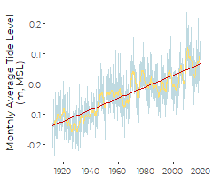
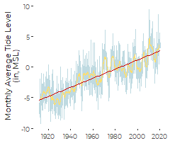
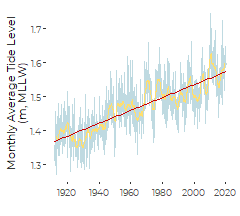
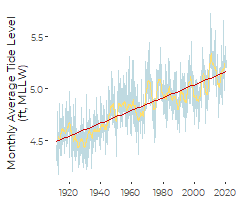
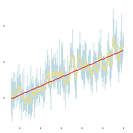
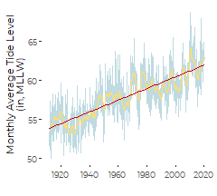

Alternative Graphics for Sea Level Rise at Portland, Maine
================
Curtis C. Bohlen

-   [Introduction](#introduction)
-   [Import Libraries](#import-libraries)
-   [Import Data](#import-data)
-   [Mimic the NOAA Graphic](#mimic-the-noaa-graphic)
    -   [In Meters MSL](#in-meters-msl)
    -   [In Feet, MSL](#in-feet-msl)
    -   [In Inches, MSL](#in-inches-msl)
    -   [In Meters MLLW](#in-meters-mllw)
    -   [In Feet, MLLW](#in-feet-mllw)
    -   [In Inches, MLLW](#in-inches-mllw)


# Introduction

Here we prepare alternate graphics for depicting local sea level rise in
Portland. All data is derived from NOAA Tides and Currents or COPS data
for the tide gauge in Portland, Maine. Since NOAA provides clean data as
monthly values, we need only plot NOAA data, with minimal processing.

# Import Libraries

``` r
library(tidyverse)
#> -- Attaching packages --------------------------------------- tidyverse 1.3.0 --
#> v ggplot2 3.3.3     v purrr   0.3.4
#> v tibble  3.0.5     v dplyr   1.0.3
#> v tidyr   1.1.2     v stringr 1.4.0
#> v readr   1.4.0     v forcats 0.5.0
#> -- Conflicts ------------------------------------------ tidyverse_conflicts() --
#> x dplyr::filter() masks stats::filter()
#> x dplyr::lag()    masks stats::lag()
library(readr)

library(zoo)     # for the rollmean function
#> 
#> Attaching package: 'zoo'
#> The following objects are masked from 'package:base':
#> 
#>     as.Date, as.Date.numeric

library(nlme)    # for gls
#> 
#> Attaching package: 'nlme'
#> The following object is masked from 'package:dplyr':
#> 
#>     collapse

library(CBEPgraphics)

load_cbep_fonts()
```

# Import Data

Our primary source data is based on NOAA’s analysis of sea level trends.
The description on the source web site
(<https://tidesandcurrents.noaa.gov/datums.html?id=8418150>) says the
following, so this is apparently NOT raw data.

> “The plot shows the monthly mean sea level without the regular
> seasonal fluctuations due to coastal ocean temperatures, salinities,
> winds, atmospheric pressures, and ocean currents. … The plotted values
> are relative to the most recent Mean Sea Level datum established by
> CO-OPS.”

For convenience, we want to be able to report these elevations as
positive values, which makes it easier for readers to compare
elevations. NOAA uses a datum of MLLW for charting purposes. We follow
that practice here.

According to <https://tidesandcurrents.noaa.gov/datums.html?id=8418150>,
at Portland, MLLW has an elevation (in feet) of 0.0 , while MSL has an
elevation of 4.94. We can convert elevations in inches MSL to elevations
in inches MLLW) as follows:

$$
E\_{MLLW} = E\_{MSL} + (4.94 ft\\times \\frac{12 in}{1 ft})
$$
An alternative is to declare some other arbitrary sea level datum as a
“Relative Sea Level.” We prepare a graphic that way, below, but chose
not to use it.

``` r
sibfldnm <- 'Original Data'
parent <- dirname(getwd())
sibling <- file.path(parent,sibfldnm)

dir.create(file.path(getwd(), 'figures'), showWarnings = FALSE)
```

``` r
fn <- '8418150_meantrend.csv'

fpath <- file.path(sibling, fn)

slr_data  <- read_csv(fpath, skip = 1,
                      col_names = c('Year', 'Month', 'Monthly_MSL', 
                                    'Unverified', 'Linear_Trend', 'High_Conf.', 
                                    'Low_Conf.', 'Empty'),
                      col_types = "iidddddd") %>%
  select(-Empty, -Unverified) %>%
  rename(MSL = Monthly_MSL) %>%
  mutate(theDate = as.Date(paste0(Year,'/', Month,'/',15), format = '%Y/%m/%d')) %>%
  mutate(MSL_ft  = MSL * 3.28084,
         MSL_in  = MSL_ft * 12,
         MLLW    = MSL +    1.506,
         MLLW_ft = MLLW  * 3.28084,
         MLLW_in = MLLW_ft * 12)
```

# Mimic the NOAA Graphic

This a redrawing of the NOAA “Mean Sea Level Trend” graphic for
Portland. I have added a 24 month (2 year) moving average.

## In Meters MSL

``` r
ggplot(slr_data, aes(theDate, MSL)) + 
  geom_line(color=cbep_colors()[1], alpha = 0.25, size = 0.5) +
  geom_line(aes(y=rollmean(MSL,24, na.pad=TRUE)), 
            color=cbep_colors()[2], size = 0.5) +
  geom_smooth(method='lm', se=FALSE, color='red3', size = 0.5) + 
  
  theme_cbep(base_size = 8) + 
  xlab('') + 
  ylab('Monthly Average Tide Level\n(m, MSL)')
#> `geom_smooth()` using formula 'y ~ x'
#> Warning: Removed 23 row(s) containing missing values (geom_path).
```



``` r
ggsave('figures/Portland_SLR_meters_msl.pdf', 
       device = cairo_pdf, width = 2.25, height = 2.25)
#> `geom_smooth()` using formula 'y ~ x'
#> Warning: Removed 23 row(s) containing missing values (geom_path).
```

``` r
ggplot(slr_data, aes(theDate, MSL)) + 
  geom_line(color=cbep_colors()[1], alpha = 0.25, size = 0.5) +
  geom_line(aes(y=rollmean(MSL,24, na.pad=TRUE)), 
            color=cbep_colors()[2], size = 0.5) +
  geom_smooth(method='lm', se=FALSE, color='red3', size = 0.5) + 
  
  theme_cbep(base_size = 8) + 
  theme(axis.text = element_blank(), 
        axis.title = element_blank()) +
  xlab('') + 
  ylab('')
#> `geom_smooth()` using formula 'y ~ x'
#> Warning: Removed 23 row(s) containing missing values (geom_path).
```


``` r
ggsave('figures/Portland_SLR_meters_msl_bare.pdf', 
       device = cairo_pdf, width = 2, height = 2)
#> `geom_smooth()` using formula 'y ~ x'
#> Warning: Removed 23 row(s) containing missing values (geom_path).
```

## In Feet, MSL

``` r
ggplot(slr_data, aes(theDate, MSL_ft)) + 
  geom_line(color=cbep_colors()[1], alpha = 0.25, size = 0.5) +
  geom_line(aes(y=rollmean(MSL_ft,24, na.pad=TRUE)), 
            color=cbep_colors()[2], size = 0.5) +
  geom_smooth(method='lm', se=FALSE, color='red3', size = 0.5) + 
  
  theme_cbep(base_size = 8) + 
  xlab('') + 
  ylab('Monthly Average Tide Level\n(ft, MSL)')
#> `geom_smooth()` using formula 'y ~ x'
#> Warning: Removed 23 row(s) containing missing values (geom_path).
```


``` r
ggsave('figures/Portland_SLR_feet_msl.pdf', 
       device = cairo_pdf, width = 2.25, height = 2.25)
#> `geom_smooth()` using formula 'y ~ x'
#> Warning: Removed 23 row(s) containing missing values (geom_path).
```

``` r
ggplot(slr_data, aes(theDate, MSL_ft)) + 
  geom_line(color=cbep_colors()[1], alpha = 0.25, size = 0.5) +
  geom_line(aes(y=rollmean(MSL_ft,24, na.pad=TRUE)), 
            color=cbep_colors()[2], size = 0.5) +
  geom_smooth(method='lm', se=FALSE, color='red3', size = 0.5) + 
  
  theme_cbep(base_size = 8) + 
  theme(axis.text = element_blank(), 
        axis.title = element_blank()) +
  xlab('') + 
  ylab('')
#> `geom_smooth()` using formula 'y ~ x'
#> Warning: Removed 23 row(s) containing missing values (geom_path).
```


``` r
ggsave('figures/Portland_SLR_feet_msl_bare.pdf', 
       device = cairo_pdf, width = 2, height = 2)
#> `geom_smooth()` using formula 'y ~ x'
#> Warning: Removed 23 row(s) containing missing values (geom_path).
```

## In Inches, MSL

``` r
ggplot(slr_data, aes(theDate, MSL_in)) + 
  geom_line(color=cbep_colors()[1], alpha = 0.25, size = 0.5) +
  geom_line(aes(y=rollmean(MSL_in,24, na.pad=TRUE)), 
            color=cbep_colors()[2], size = 0.5) +
  geom_smooth(method='lm', se=FALSE, color='red3', size = 0.5) + 
  
  theme_cbep(base_size = 8) + 
  xlab('') + 
  ylab('Monthly Average Tide Level\n(in, MSL)')
#> `geom_smooth()` using formula 'y ~ x'
#> Warning: Removed 23 row(s) containing missing values (geom_path).
```



``` r
ggsave('figures/Portland_SLR_inches_msl.pdf', 
       device = cairo_pdf, width = 2.25, height = 2.25)
#> `geom_smooth()` using formula 'y ~ x'
#> Warning: Removed 23 row(s) containing missing values (geom_path).
```

``` r
ggplot(slr_data, aes(theDate, MSL_in)) + 
  geom_line(color=cbep_colors()[1], alpha = 0.25, size = 0.5) +
  geom_line(aes(y=rollmean(MSL_in,24, na.pad=TRUE)), 
            color=cbep_colors()[2], size = 0.5) +
  geom_smooth(method='lm', se=FALSE, color='red3', size = 0.5) + 
  
  theme_cbep(base_size = 8) + 
  theme(axis.text = element_blank(), 
        axis.title = element_blank()) +
  xlab('') + 
  ylab('')
#> `geom_smooth()` using formula 'y ~ x'
#> Warning: Removed 23 row(s) containing missing values (geom_path).
```


``` r
ggsave('figures/Portland_SLR_inches_msl_bare.pdf', 
       device = cairo_pdf, width = 2, height = 2)
#> `geom_smooth()` using formula 'y ~ x'
#> Warning: Removed 23 row(s) containing missing values (geom_path).
```

## In Meters MLLW

``` r
ggplot(slr_data, aes(theDate, MLLW)) + 
  geom_line(color=cbep_colors()[1], alpha = 0.25, size = 0.5) +
  geom_line(aes(y=rollmean(MLLW,24, na.pad=TRUE)), 
            color=cbep_colors()[2], size = 0.5) +
  geom_smooth(method='lm', se=FALSE, color='red3', size = 0.5) + 
  
  theme_cbep(base_size = 8) + 
  xlab('') + 
  ylab('Monthly Average Tide Level\n(m, MLLW)')
#> `geom_smooth()` using formula 'y ~ x'
#> Warning: Removed 23 row(s) containing missing values (geom_path).
```



``` r
ggsave('figures/Portland_SLR_meters_mllw.pdf', 
       device = cairo_pdf, width = 2.25, height = 2.25)
#> `geom_smooth()` using formula 'y ~ x'
#> Warning: Removed 23 row(s) containing missing values (geom_path).
```

``` r
ggplot(slr_data, aes(theDate, MLLW)) + 
  geom_line(color=cbep_colors()[1], alpha = 0.25, size = 0.5) +
  geom_line(aes(y=rollmean(MLLW,24, na.pad=TRUE)), 
            color=cbep_colors()[2], size = 0.5) +
  geom_smooth(method='lm', se=FALSE, color='red3', size = 0.5) + 
  
  theme_cbep(base_size = 8) + 
  theme(axis.text = element_blank(), 
        axis.title = element_blank()) +
  xlab('') + 
  ylab('')
#> `geom_smooth()` using formula 'y ~ x'
#> Warning: Removed 23 row(s) containing missing values (geom_path).
```


``` r
ggsave('figures/Portland_SLR_meters_mllw_bare.pdf', 
       device = cairo_pdf, width = 2, height = 2)
#> `geom_smooth()` using formula 'y ~ x'
#> Warning: Removed 23 row(s) containing missing values (geom_path).
```

## In Feet, MLLW

``` r
ggplot(slr_data, aes(theDate, MLLW_ft)) + 
  geom_line(color=cbep_colors()[1], alpha = 0.25, size = 0.5) +
  geom_line(aes(y=rollmean(MLLW_ft,24, na.pad=TRUE)), 
            color=cbep_colors()[2], size = 0.5) +
  geom_smooth(method='lm', se=FALSE, color='red3', size = 0.5) + 
  
  theme_cbep(base_size = 8) + 
  xlab('') + 
  ylab('Monthly Average Tide Level\n(ft, MLLW)')
#> `geom_smooth()` using formula 'y ~ x'
#> Warning: Removed 23 row(s) containing missing values (geom_path).
```



``` r
ggsave('figures/Portland_SLR_feet_mllw.pdf', 
       device = cairo_pdf, width = 2.25, height = 2.25)
#> `geom_smooth()` using formula 'y ~ x'
#> Warning: Removed 23 row(s) containing missing values (geom_path).
```

``` r
ggplot(slr_data, aes(theDate, MLLW_ft)) + 
  geom_line(color=cbep_colors()[1], alpha = 0.25, size = 0.5) +
  geom_line(aes(y=rollmean(MLLW_ft,24, na.pad=TRUE)), 
            color=cbep_colors()[2], size = 0.5) +
  geom_smooth(method='lm', se=FALSE, color='red3', size = 0.5) + 
  
  theme_cbep(base_size = 8) + 
  theme(axis.text = element_blank(), 
        axis.title = element_blank()) +
  xlab('') + 
  ylab('')
#> `geom_smooth()` using formula 'y ~ x'
#> Warning: Removed 23 row(s) containing missing values (geom_path).
```



``` r
ggsave('figures/Portland_SLR_feet_mllw_bare.pdf', 
       device = cairo_pdf, width = 2, height = 2)
#> `geom_smooth()` using formula 'y ~ x'
#> Warning: Removed 23 row(s) containing missing values (geom_path).
```

## In Inches, MLLW

``` r
ggplot(slr_data, aes(theDate, MLLW_in)) + 
  geom_line(color=cbep_colors()[1], alpha = 0.25, size = 0.5) +
  geom_line(aes(y=rollmean(MLLW_in,24, na.pad=TRUE)), 
            color=cbep_colors()[2], size = 0.5) +
  geom_smooth(method='lm', se=FALSE, color='red3', size = 0.5) + 
  
  theme_cbep(base_size = 8) + 
  xlab('') + 
  ylab('Monthly Average Tide Level\n(in, MLLW)')
#> `geom_smooth()` using formula 'y ~ x'
#> Warning: Removed 23 row(s) containing missing values (geom_path).
```



``` r
ggsave('figures/Portland_SLR_inches_mllw.pdf', 
       device = cairo_pdf, width = 2.25, height = 2.25)
#> `geom_smooth()` using formula 'y ~ x'
#> Warning: Removed 23 row(s) containing missing values (geom_path).
```

``` r
ggplot(slr_data, aes(theDate, MSL_in)) + 
  geom_line(color=cbep_colors()[1], alpha = 0.25, size = 0.5) +
  geom_line(aes(y=rollmean(MSL_in,24, na.pad=TRUE)), 
            color=cbep_colors()[2], size = 0.5) +
  geom_smooth(method='lm', se=FALSE, color='red3', size = 0.5) + 
  
  theme_cbep(base_size = 8) + 
  theme(axis.text = element_blank(), 
        axis.title = element_blank()) +
  xlab('') + 
  ylab('')
#> `geom_smooth()` using formula 'y ~ x'
#> Warning: Removed 23 row(s) containing missing values (geom_path).
```


``` r
ggsave('figures/Portland_SLR_inches_mllw_bare.pdf', 
       device = cairo_pdf, width = 2, height = 2)
#> `geom_smooth()` using formula 'y ~ x'
#> Warning: Removed 23 row(s) containing missing values (geom_path).
```
