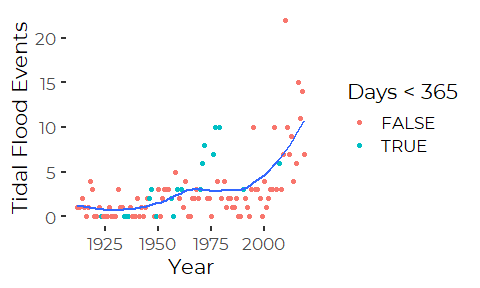
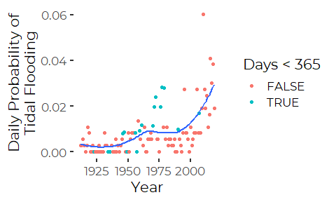
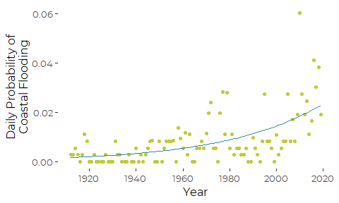
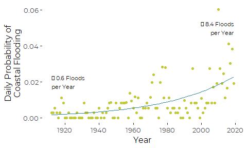
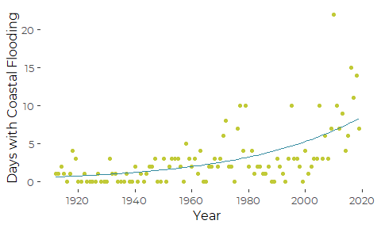
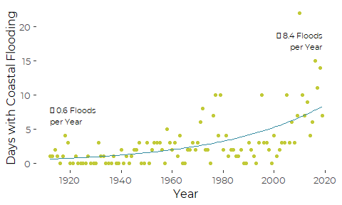

Daily Frequency of Tidal Flooding Events 1912 to 2019
================
Curtis C. Bohlen
December 14, 2020

  - [Introduction](#introduction)
  - [Import Libraries](#import-libraries)
  - [Import Data](#import-data)
  - [Preliminary Graphics](#preliminary-graphics)
  - [Generalized Linear Model](#generalized-linear-model)
      - [Graphics Showing Model
        Results](#graphics-showing-model-results)
          - [Daily Probability of
            Flooding](#daily-probability-of-flooding)
          - [Number of Days of with Recorded
            Flooding](#number-of-days-of-with-recorded-flooding)


# Introduction

One reviewer pointed out that for all weather-related events, we
presented data in SoCB on the changing frequency of “events” over time,
including hot days, cold days, large storms, etc. They suggested we
consider showing a similar graphic showing changes in frequency of tidal
flooding events. This Notebook takes a look at the historical record.

We follow Maine Geological Survey’s practice of declaring a tidal
flooding event whenever tidal observations exceed the current “Highest
Astronomical Tide” or HAT level, which is 11.95 feet, or 3.640 meters
above mean lower low water (MLLW) at Portland.

That HAT level, strictly speaking, is defined in terms of a specific 19
year long tidal epoch, from 1983 through 2001, but it provides a useful
and consistent benchmark for extreme high tides.

# Import Libraries

``` r
library(tidyverse)
#> -- Attaching packages --------------------------------------- tidyverse 1.3.0 --
#> v ggplot2 3.3.2     v purrr   0.3.4
#> v tibble  3.0.4     v dplyr   1.0.2
#> v tidyr   1.1.2     v stringr 1.4.0
#> v readr   1.4.0     v forcats 0.5.0
#> -- Conflicts ------------------------------------------ tidyverse_conflicts() --
#> x dplyr::filter() masks stats::filter()
#> x dplyr::lag()    masks stats::lag()
library(readr)

#library(zoo)     # for the rollmean function

#library(nlme)    # for gls

library(CBEPgraphics)
load_cbep_fonts()
theme_set(theme_cbep())
```

# Import Data

Our primary source data is hourly data on observed and predicted water
levels at the Portland tide station (Station 8418150). We accessed these
data using small python scripts to download and assemble consistent data
from the NOAA Tides and Currents API. Details are provided in the
“Original Data” folder.

``` r
sibfldnm <- 'Original Data'
parent <- dirname(getwd())
sibling <- file.path(parent,sibfldnm)

dir.create(file.path(getwd(), 'figures'), showWarnings = FALSE)
```

``` r
fn <- 'portland_tides_hourly.csv'
fpath <- file.path(sibling, fn)

observed_data  <- read_csv(fpath, col_types = cols(Time = col_time('%H:%M'))) %>%
  rename(MLLW = `Water Level`,
         theDate =`Date`) %>%
  mutate(Year = as.numeric(format(theDate, '%Y')),
         MLLW_ft = MLLW * 3.28084,
         Exceeds = MLLW > 3.640)
```

``` r
obs_daily <- observed_data %>%
  group_by(theDate) %>%
  summarize(Year = first(Year),
            Exceeded = any(Exceeds, na.rm = TRUE),
            n = sum(! is.na(Exceeds)),
            .groups = 'drop')
```

``` r
obs_annual <- obs_daily %>%
  filter(n == 24) %>%  # eliminate any partial records
  group_by(Year) %>%
  summarize(Days = n(),
            Floods = sum(Exceeded),
            NoFloods = Days - Floods,
            prob_flood = Floods/Days,
            .groups = 'drop')
```

# Preliminary Graphics

``` r
ggplot(obs_annual, aes(Year, Floods)) +
  geom_point(aes(color = Days<365)) +
  geom_smooth(se = FALSE) +
  ylab('Tidal Flood Events')
#> `geom_smooth()` using method = 'loess' and formula 'y ~ x'
```



We have a slight problem with figuring out how to analyze this, as we
need to decide whether to analyze as though we have data from all days
or not. It simplifies the graphics, but since years with partial data
are mostly early in the record, it may bias results.

``` r
ggplot(obs_annual, aes(Year, prob_flood)) +
  geom_point(aes(color = Days<365)) +
  geom_smooth(se = FALSE) +
  
  ylab('Daily Probability of\nTidal Flooding' )
#> `geom_smooth()` using method = 'loess' and formula 'y ~ x'
```



# Generalized Linear Model

We fit a binomial model to the number of days flooded versus the number
of ’ days without flooding, thus estimating the annual daily probability
of flooding

``` r
the_glm <- glm(cbind(Floods, NoFloods) ~ Year, family = 'binomial',
               data = obs_annual)
summary(the_glm)
#> 
#> Call:
#> glm(formula = cbind(Floods, NoFloods) ~ Year, family = "binomial", 
#>     data = obs_annual)
#> 
#> Deviance Residuals: 
#>     Min       1Q   Median       3Q      Max  
#> -3.2161  -1.3553  -0.3791   0.7330   4.7221  
#> 
#> Coefficients:
#>               Estimate Std. Error z value Pr(>|z|)    
#> (Intercept) -53.842246   4.239641  -12.70   <2e-16 ***
#> Year          0.024809   0.002133   11.63   <2e-16 ***
#> ---
#> Signif. codes:  0 '***' 0.001 '**' 0.01 '*' 0.05 '.' 0.1 ' ' 1
#> 
#> (Dispersion parameter for binomial family taken to be 1)
#> 
#>     Null deviance: 405.53  on 107  degrees of freedom
#> Residual deviance: 245.59  on 106  degrees of freedom
#> AIC: 485.49
#> 
#> Number of Fisher Scoring iterations: 5
```

``` r
anova(the_glm, test = 'LRT')
#> Analysis of Deviance Table
#> 
#> Model: binomial, link: logit
#> 
#> Response: cbind(Floods, NoFloods)
#> 
#> Terms added sequentially (first to last)
#> 
#> 
#>      Df Deviance Resid. Df Resid. Dev  Pr(>Chi)    
#> NULL                   107     405.53              
#> Year  1   159.94       106     245.59 < 2.2e-16 ***
#> ---
#> Signif. codes:  0 '***' 0.001 '**' 0.01 '*' 0.05 '.' 0.1 ' ' 1
```

## Graphics Showing Model Results

``` r
obs_annual <- obs_annual %>%
  mutate(predict = predict(the_glm, type = 'response'))
```

### Daily Probability of Flooding

``` r
plt <- ggplot(obs_annual, aes(Year, prob_flood)) +
  geom_point(color =cbep_colors()[4]) +
  geom_line(aes(y = predict),
            color = cbep_colors()[5]) +
  
  ylab('Daily Probability of\nCoastal Flooding' ) +

  scale_x_continuous(breaks = c(1920, 1940, 1960, 1980, 2000, 2020)) +
    
  theme_cbep(base_size = 12)

plt
```



``` r
annot_data <- obs_annual %>%
  filter(Year %in% c(1912, 2019)) %>%
  mutate(annot = paste("\u2213", 
                       round(365 * predict,1),
                       'Floods\nper Year'),
         height = c(0.02, 0.05)) %>%
  
  select(Year, height, annot)
annot_data
#> # A tibble: 2 x 3
#>    Year height annot                   
#>   <dbl>  <dbl> <chr>                   
#> 1  1912   0.02 "± 0.6 Floods\nper Year"
#> 2  2019   0.05 "± 8.4 Floods\nper Year"
```

Unfortunately this font, and default fonts do not have the +/- glyph, so
we get an empty square box.

``` r
plt +
  geom_text(aes(x = Year, y = height, label = annot, hjust = c(0,1)),
            data = annot_data, size = 3)
```



``` r

ggsave('figures/Portland_tidal_flooding.pdf', 
       device = cairo_pdf, width = 5, height = 3)
```

### Number of Days of with Recorded Flooding

``` r
plt2 <- ggplot(obs_annual, aes(Year, Floods)) +
  geom_point(color =cbep_colors()[4]) +
  geom_line(aes(y = predict * 365),
            color = cbep_colors()[5]) +
  
  ylab('Days with Coastal Flooding') +
  
  scale_x_continuous(breaks = c(1920, 1940, 1960, 1980, 2000, 2020)) +
    
  theme_cbep(base_size = 12)
plt2
```



``` r
annot_data <- obs_annual %>%
  filter(Year %in% c(1912, 2019)) %>%
  mutate(annot = paste("\u2213", 
                       round(365 * predict,1),
                       'Floods\nper Year'),
         height = c(7, 18)) %>%
  
  select(Year, height, annot)
annot_data
#> # A tibble: 2 x 3
#>    Year height annot                   
#>   <dbl>  <dbl> <chr>                   
#> 1  1912      7 "± 0.6 Floods\nper Year"
#> 2  2019     18 "± 8.4 Floods\nper Year"
```

``` r
plt2 +
  geom_text(aes(x = Year, y = height, label = annot, hjust = c(0,1)),
            data = annot_data, size = 3)
```



``` r

ggsave('figures/Portland_tidal_flooding_alt.pdf', 
       device = cairo_pdf, width = 5, height = 3)
```
