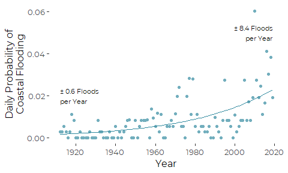
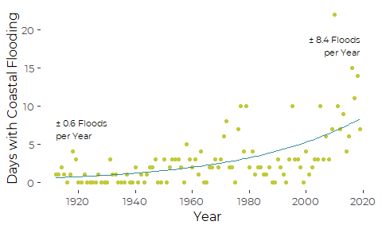
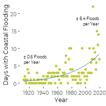
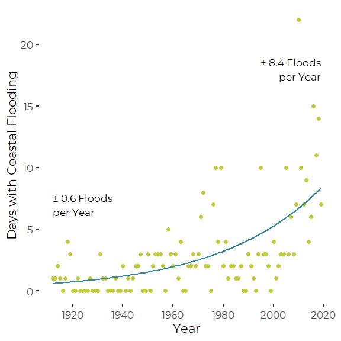

Daily Frequency of Tidal Flooding Events 1912 to 2019
================
Curtis C. Bohlen
December 14, 2020

-   [Introduction](#introduction)
-   [Import Libraries](#import-libraries)
-   [Import Data](#import-data)
-   [Generalized Linear Model](#generalized-linear-model)
    -   [Graphics](#graphics)
        -   [Daily Probability of
            Flooding](#daily-probability-of-flooding)
        -   [Number of Days of with Recorded
            Flooding](#number-of-days-of-with-recorded-flooding)


# Introduction

One reviewer of an early draft of oue “CLimate Change” Chapter pointed
out that for all weather-related events, we presented data in SoCB on
the changing frequency of “events” over time, including hot days, cold
days, large storms, etc. They suggested we consider showing a similar
graphic showing changes in frequency of tidal flooding events. This
Notebook outlines the way we generated graphics to respond to teh
reviewer’s comments.

We follow Maine Geological Survey’s practice of declaring a tidal
flooding event whenever tidal observations exceed the current “Highest
Astronomical Tide” or HAT level, which is 11.95 feet, or 3.640 meters
above mean lower low water (MLLW) at Portland.

That HAT level, strictly speaking, is defined in terms of a specific 19
year long tidal epoch, from 1983 through 2001, but it provides a useful
and consistent benchmark for extreme high tides.

# Import Libraries

``` r
library(tidyverse)
#> Warning: package 'tidyverse' was built under R version 4.0.5
#> -- Attaching packages --------------------------------------- tidyverse 1.3.1 --
#> v ggplot2 3.3.5     v purrr   0.3.4
#> v tibble  3.1.6     v dplyr   1.0.7
#> v tidyr   1.1.4     v stringr 1.4.0
#> v readr   2.1.0     v forcats 0.5.1
#> Warning: package 'ggplot2' was built under R version 4.0.5
#> Warning: package 'tidyr' was built under R version 4.0.5
#> Warning: package 'dplyr' was built under R version 4.0.5
#> Warning: package 'forcats' was built under R version 4.0.5
#> -- Conflicts ------------------------------------------ tidyverse_conflicts() --
#> x dplyr::filter() masks stats::filter()
#> x dplyr::lag()    masks stats::lag()
library(readr)

#library(zoo)     # for the rollmean function

#library(nlme)    # for gls

library(CBEPgraphics)
load_cbep_fonts()
theme_set(theme_cbep())
```

# Import Data

Our primary source data is hourly data on observed water levels at the
Portland tide station (Station 8418150). We accessed these data using
small python scripts to download and assemble consistent data from the
NOAA Tides and Currents API.

``` r
sibfldnm <- 'Data'
parent <- dirname(getwd())
sibling <- file.path(parent,sibfldnm)

dir.create(file.path(getwd(), 'figures'), showWarnings = FALSE)
```

``` r
fn <- 'portland_tides_hourly.csv'
fpath <- file.path(sibling, fn)

observed_data  <- read_csv(fpath, col_types = cols(Time = col_time('%H:%M'))) %>%
  rename(MLLW = `Water Level`,
         theDate =`Date`) %>%
  mutate(Year = as.numeric(format(theDate, '%Y')),
         MLLW_ft = MLLW * 3.28084,
         Exceeds = MLLW > 3.640)
```

We then check each day and determine whether the hourly data exceeded
HAT, our chosen flood elevation.

``` r
obs_daily <- observed_data %>%
  group_by(theDate) %>%
  summarize(Year = first(Year),
            Exceeded = any(Exceeds, na.rm = TRUE),
            n = sum(! is.na(Exceeds)),
            .groups = 'drop')
```

Finally, we group daily observations by year, and count up days with
flooding.

``` r
obs_annual <- obs_daily %>%
  filter(n == 24) %>%  # eliminate any partial records
  group_by(Year) %>%
  summarize(Days = n(),
            Floods = sum(Exceeded),
            NoFloods = Days - Floods,
            prob_flood = Floods/Days,
            .groups = 'drop')
```

# Generalized Linear Model

We fit a binomial model to the number of days flooded versus the number
of ’ days without flooding, thus estimating the annual daily probability
of flooding.

``` r
the_glm <- glm(cbind(Floods, NoFloods) ~ Year, family = 'binomial',
               data = obs_annual)

obs_annual <- obs_annual %>%
  mutate(predict = predict(the_glm, type = 'response'))
```

## Graphics

We have a decision to make figuring out what to present. We do not have
365 days of data from each year, so the total number of flood events is
(slightly) biased by annual samples. In years with incomplete data, we
would naturally expect to observe fewer days with tidal flooding.
Luckily, in this context, and based on available data from Portland, the
difference is largely immaterial.

### Daily Probability of Flooding

We start with a figure where the value we show on the Y axis is the
daily probability of there being a flooding event. Each dot in this
image is scaled by the actual number of days for which we have data.

#### Create Annotatons

``` r
annot_data <- obs_annual %>%
  filter(Year %in% c(1912, 2019)) %>%
  mutate(annot = paste("\u00B1", 
                       round(365 * predict,1),
                       'Floods\nper Year'),
         height = c(0.02, 0.05)) %>%
  
  select(Year, height, annot)
annot_data
#> # A tibble: 2 x 3
#>    Year height annot                   
#>   <dbl>  <dbl> <chr>                   
#> 1  1912   0.02 "± 0.6 Floods\nper Year"
#> 2  2019   0.05 "± 8.4 Floods\nper Year"
```

#### produce the Plot

``` r
plt <- ggplot(obs_annual, aes(Year, prob_flood)) +
  geom_point(color =cbep_colors()[6]) +
  geom_line(aes(y = predict),
            color = cbep_colors()[5]) +
  
  ylab('Daily Probability of\nCoastal Flooding' ) +

  scale_x_continuous(breaks = c(1920, 1940, 1960, 1980, 2000, 2020)) +
    
  theme_cbep(base_size = 12)
```

``` r
plt +
  geom_text(aes(x = Year, y = height, label = annot, hjust = c(0,1)),
            data = annot_data, size = 3)
```



``` r
ggsave('figures/Portland_tidal_flooding_probability.pdf', 
       device = cairo_pdf, width = 5, height = 3)
```

That graphic is in some ways superior to the graphic we develop next,
since the Y axis values of the prediction line and the data points are
fully consistent.  
But the Y axis scale (with low daily probablities) may be confusing to
some readers. Furthermore, in this graphic, the position of the dots
reflects an assumption about the exchangeability of days of the year. We
don’t really beliee that the probability of flooding is equal. For
example, flood events are likely to be more probable at some times of
year than others.

The choice of which graphic is more appropriate may rest on just how
incomplete the data is from earlier years. For Portland, the data from
most years is nearly complete, so the choice makes little difference.

### Number of Days of with Recorded Flooding

Here, we prepare an alternative graphic that scales the Y axis by the
number of days per year with observed tidal flood events.

``` r
annot_data <- obs_annual %>%
  filter(Year %in% c(1912, 2019)) %>%
  mutate(annot = paste("\u00B1", 
                       round(365 * predict,1),
                       'Floods\nper Year'),
         height = c(7, 18)) %>%
  
  select(Year, height, annot)
annot_data
#> # A tibble: 2 x 3
#>    Year height annot                   
#>   <dbl>  <dbl> <chr>                   
#> 1  1912      7 "± 0.6 Floods\nper Year"
#> 2  2019     18 "± 8.4 Floods\nper Year"
```

``` r
plt2 <- ggplot(obs_annual, aes(Year, Floods)) +
  geom_point(color =cbep_colors()[4]) +
  geom_line(aes(y = predict * 365),
            color = cbep_colors()[5]) +
  
  ylab('Days with Coastal Flooding') +
  
  scale_x_continuous(breaks = c(1920, 1940, 1960, 1980, 2000, 2020)) +
    
  theme_cbep(base_size = 12)
```

``` r
plt2 +
  geom_text(aes(x = Year, y = height, label = annot, hjust = c(0,1)),
            data = annot_data, size = 3)
```



``` r
ggsave('figures/Portland_tidal_flooding_count.pdf', 
       device = cairo_pdf, width = 5, height = 3)
```

#### Smaller Version

``` r
plt2 +
  geom_text(aes(x = Year, y = height, label = annot, hjust = c(0,1)),
            data = annot_data, size = 2) +
  theme_cbep(base_size = 9)
```



``` r
ggsave('figures/small_Portland_tidal_flooding_count_small.pdf', 
       device = cairo_pdf, width = 2.25, height = 2.25)
```

#### Lightly Modified for Powerpoint Use

``` r
plt3 <- ggplot(obs_annual, aes(Year, Floods)) +
  geom_point(color =cbep_colors()[4], size = 2) +
  geom_line(aes(y = predict * 365),
            color = cbep_colors()[5],
            size = 1) +
  
  ylab('Days with Coastal Flooding') +
  
  scale_x_continuous(breaks = c(1920, 1940, 1960, 1980, 2000, 2020))
```

``` r
plt3 +
  geom_text(aes(x = Year, y = height, label = annot, hjust = c(0,1)),
            data = annot_data, size = 4.5)
```



``` r
ggsave('figures/Portland_tidal_flooding_count_square.png', type='cairo',
         width = 6, height = 6)
```
